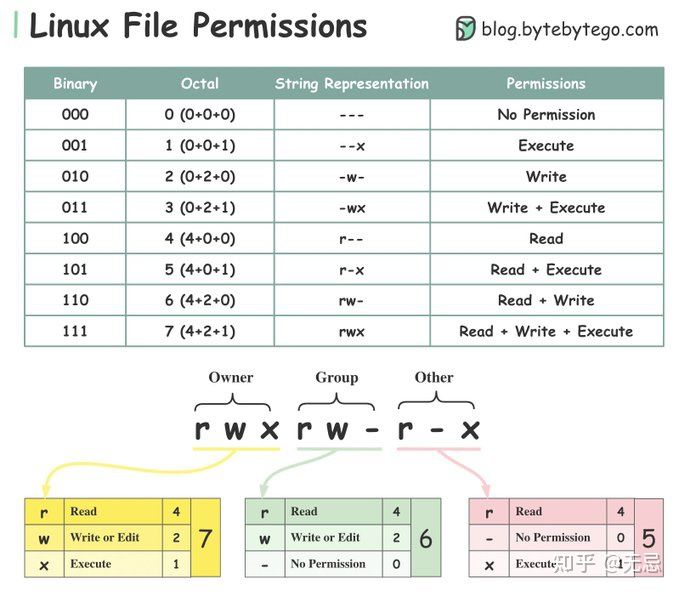

# 运维命令

不做特殊说明，都是CentOS操作系统下的命令。

## Linux文件/目录权限

 

`x`: 对于目录而言，要有`x`可执行权限，才能`cd`进入到该目录


## 修改目录/文件权限

```bash
chmod 777 dir_name // 777表示Owner, Group, Other对该文件或者目录都拥有可读、可写和可执行的权限
```


## 用户管理

```bash
# 添加用户
useradd user_name
# 设置密码
passwd user_name
# 查看用户信息
id user_name
# 查看当前用户
whoami
# 切换用户su: switch user
su user_name
```


## 防火墙

**注意**：修改了防火墙配置后，需要重启防火墙

### 开放端口

```bash
firewall-cmd --permanent --add-port=80/tcp
```

### 重启防火墙

```bash
firewall-cmd --reload
```


## 文件上传

### 上传本地文件或目录到远程服务器

```bash
scp /path/to/file username@serverip:remote_dir
scp -r local_dir username@serverip:remote_dir
```

### 从远程服务器下载文件或目录到本地

```bash
scp username@serverip:/path/to/file local_dir
scp -r username@serverip:remote_dir local_dir
```


## 查看磁盘空间的占用

看当前目录下各个文件和文件夹的空间占用

```bash
du -hs * | sort -hr | head 
```
