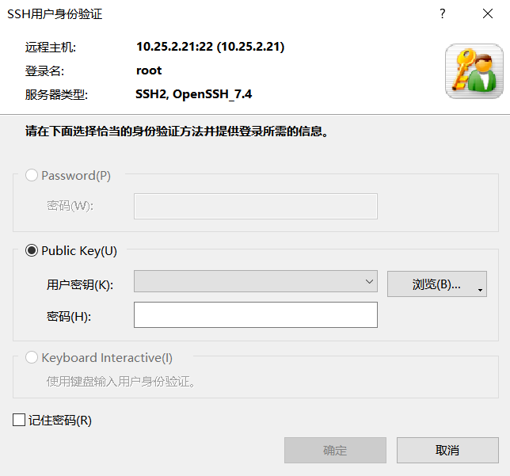
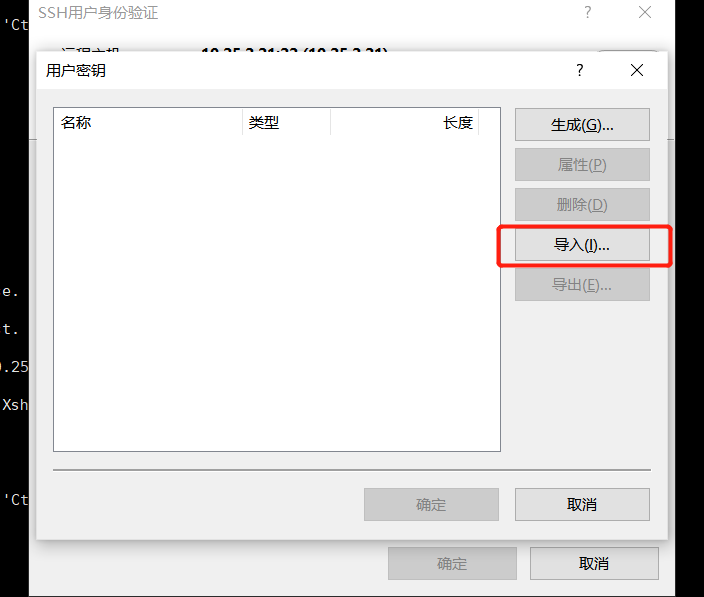
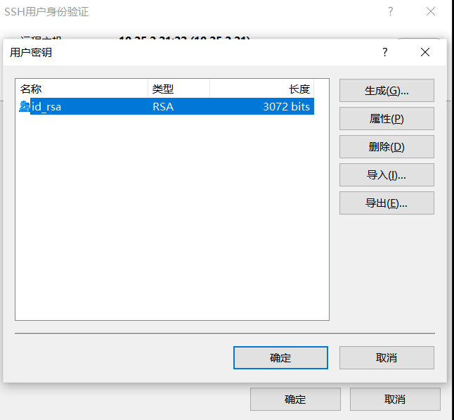
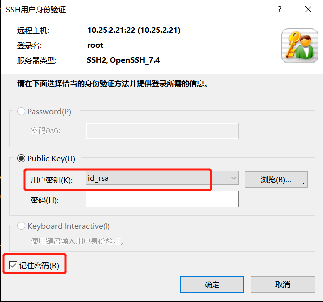

# Xshell连接如何记住用户秘钥文件

## 场景描述

服务器ssh登录有2种常用的方式：

* 方式1：用户密码认证，登录时输入用户名和密码。
* 方式2：公钥认证(Public Key User Authentication)，登录时提供用户名+私钥。公钥需要存储一份在服务器上该用户的`~/.ssh/authorized_keys`文件里。

管理比较严格的公司，会按照方式2去设置服务器登录，禁止用方式1。

因为方式1的密码容易泄露，容易出现大家共用相同的用户名和密码，相对方式2来说，安全性没那么好。

初次按照公钥认证来登录服务器的用户，可能发现每次登录服务器都要选择private key文件，不太方便。

 

那怎么让Xshell记住你的私钥，不用每次登录服务器都要手动选择私钥文件呢？

## 解决方案

* 步骤1：在登录提示框里，用户秘钥这一栏，选择浏览->用户秘钥

 

* 步骤2：在用户秘钥的弹窗里，选择导入秘钥。

 

* 步骤3：选中导入的秘钥，点击确定。

 

* 步骤4：如果该秘钥生成的时候设置了密码，在用户秘钥框下面的密码框输入密码。

  如果该秘钥没有设置密码，就不用输入密码。最后，选择记住密码，点击确定即可。(这个记住密码是记住的用户秘钥的密码)

 

## 

## 总结

公钥认证是比用户名/密码登录更安全的方式，而且在服务器出现异常行为时，也方便追踪是哪个用户的操作。

## 开源地址

文章和示例代码开源在GitHub: [开发必备运维手册](https://github.com/jincheng9/sre)。

公众号：coding进阶。关注公众号可以获取最新的开发和运维技能点。

个人网站：[Jincheng's Blog](https://jincheng9.github.io/)。

知乎：[无忌](https://www.zhihu.com/people/thucuhkwuji)。

## 福利

我为大家整理了一份后端开发学习资料礼包，包含编程语言入门到进阶知识(Go、C++、Python)、后端开发技术栈、面试题等。

关注公众号「coding进阶」，发送消息 **backend** 领取资料礼包，这份资料会不定期更新，加入我觉得有价值的资料。

发送消息「**进群**」，和同行一起交流学习，答疑解惑。
